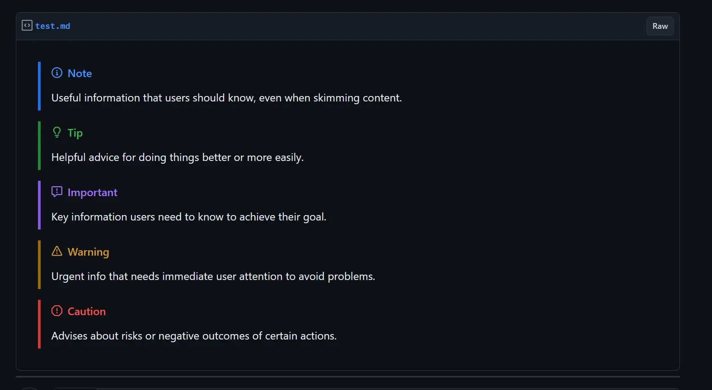
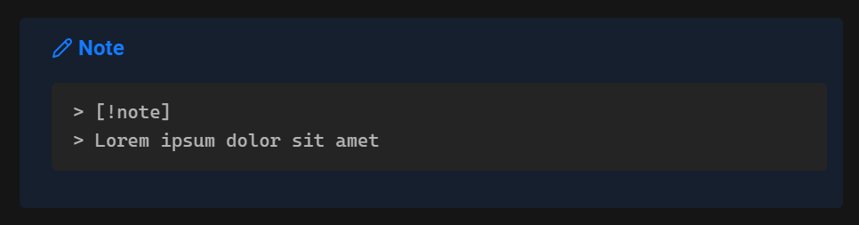
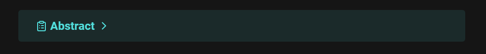
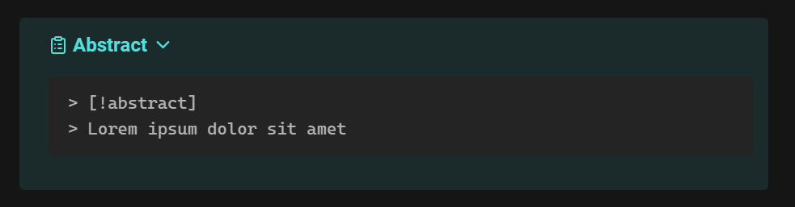

# Markdown Preview Plus

Adds support for additional styled components from Markdown syntaxes not native to VS Code.

## Features

### GitHub Alerts

### Obsidian Callouts

**Standard callout:**

**Foldable callout:**

### Highlighter

### Color Tags

### Footnotes

### Table of Contents

### Task List

## To Do
- add missing screenshots
- custom obsidian callouts
- content tab
- admonition style callouts
- refactor the styled blockquotes

## License

***
